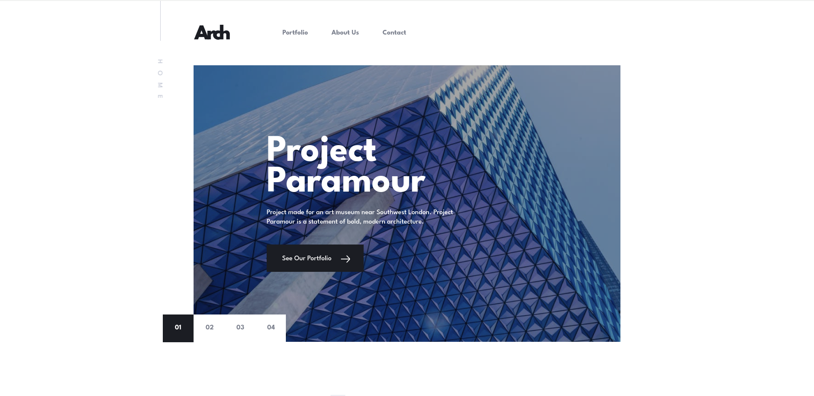

# Frontend Mentor - Arch Studio multi-page website solution

This is a solution to the [Arch Studio multi-page website challenge on Frontend Mentor](https://www.frontendmentor.io/challenges/arch-studio-multipage-website-wNIbOFYR6). Frontend Mentor challenges help you improve your coding skills by building realistic projects.

## Table of contents

- [Overview](#overview)
  - [The challenge](#the-challenge)
  - [Screenshot](#screenshot)
  - [Links](#links)
- [My process](#my-process)
  - [Built with](#built-with)
  - [What I learned](#what-i-learned)
  - [Continued development](#continued-development)
  - [Useful resources](#useful-resources)
- [Author](#author)
- [Acknowledgments](#acknowledgments)

## Overview

### The challenge

Users should be able to:

- View the optimal layout for each page depending on their device's screen size.
- See hover states for all interactive elements throughout the site.
- Receive an error message when the contact form is submitted if:
  - The `Name`, `Email`, or `Message` fields are empty should show "Can't be empty".
  - The `Email` is not formatted correctly should show "Please use a valid email address".
- **Bonus**: View actual locations on the contact page map. The addresses we have on the design are fictional, so you'll need to add real addresses for this bonus task.

### Screenshot

### Links

- Solution URL: [GitHub Repository](https://github.com/TedJenkler/Arch-Studio-SCSS-Portfolio)
- Live Site URL: [Live Demo](https://portfolio-scss-tedjenkler.netlify.app/)

## My process

### Built with

- [Vite](https://vitejs.dev/) - A frontend build tool for fast development with a modern workflow.
- [React](https://reactjs.org/) - A JavaScript library for building user interfaces.
- [SCSS](https://sass-lang.com/documentation) - For advanced styling and creating flexible, maintainable stylesheets.
- [Formik](https://formik.org/) - For managing form state and validation with ease.
- [Framer Motion](https://www.framer.com/api/motion/) - For creating smooth and interactive animations.
- [React Router v6](https://reactrouter.com/) - For handling routing in a React application.
- [Leaflet](https://leafletjs.com/) - For interactive maps.
- [Yup](https://github.com/jquense/yup) - For schema validation and form validation logic.

### What I learned

During this project, I gained more experience in the following areas:

- **SCSS:** Enhanced understanding of SCSS features like mixins, maps, variables, and responsive design.
- **CSS Overlays:** Learned how to use CSS to create overlays for darkening content.
- **Formik:** Improved skills in managing form state and validation using Formik.
- **Framer Motion:** Gained experience in creating smooth and interactive animations with Framer Motion.

### Continued Development

- Plan to make the site fully responsive on all devices.
- Add more animations and improve existing ones.

### Useful resources

- [SCSS Documentation](https://sass-lang.com/documentation) - For comprehensive details on SCSS syntax and features.
- [Formik Documentation](https://formik.org/docs) - For learning how to use Formik for form management and validation.
- [Framer Motion Documentation](https://www.framer.com/api/motion/) - For creating animations in React.
- [React Router v6 Documentation](https://reactrouter.com/) - For handling routing in React applications.
- [Leaflet Documentation](https://leafletjs.com/) - For integrating interactive maps.

## Author

- Frontend Mentor - [@TedJenkler](https://www.frontendmentor.io/profile/TedJenkler)
- LinkedIn - [Teodor Jenkler](https://www.linkedin.com/in/tedjenklerwebdeveloper/)
- X - [@TJenkler](https://x.com/TJenkler)
- Discord - [TedJenkler](https://discord.com/users/TedJenkler)
- YouTube - [WebDevwithTed](https://www.youtube.com/@WebDevwithTed)

## Acknowledgments

- Special thanks to ChatGPT for assisting with writing comments for my commits. (Would love feedback on if it is good or bad)